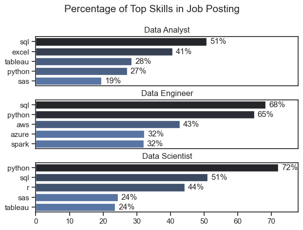

# The Analysis

## 1. What are the most demanded skills for the top 3 most popular data roles?

This analysis examines the most demanded skills for the three most popular data roles—Data Analyst, Data Scientist, and Data Engineer—by analyzing job postings and skill frequency across each role. The results show that core skills such as SQL and Python are consistently in high demand across all three positions, highlighting their importance as foundational tools in the data field. Data Analysts tend to require strong proficiency in SQL, Excel, and data visualization tools like Tableau or Power BI, reflecting their focus on querying and presenting data. Data Scientists show higher demand for Python, machine learning libraries, and statistical skills, emphasizing advanced analysis and modeling. Data Engineers, on the other hand, are most frequently associated with Python, SQL, cloud platforms, and big data technologies, underscoring their role in building and maintaining data pipelines. Overall, while each role has specialized skill requirements, the overlap in core technical skills suggests a shared foundation across data careers.

view my notebook with detailed steps here: [2_Skills_Count.ipynb](project/2_Skills_Count.ipynb)

### Visualize Data

```python 
fig, ax = plt.subplots(len(job_titles), 1)
sns.set_theme(style='ticks')

for i, job_title in enumerate(job_titles):
    df_plot = df_skills_perc[df_skills_perc['job_title_short'] == job_title].head(5)
   # df_plot.plot(kind='barh', x='job_skills', y='percent_count', ax=ax[i], title=job_title)
    sns.barplot(data=df_plot, x='percent_count', y='job_skills', ax=ax[i], hue='skill_count', palette='dark:b_r')
    ax[i].set_title(job_title)
    ax[i].set_xlabel('')
    ax[i].set_ylabel('')
    ax[i].legend().remove()
    ax[i].set_xlim(0, 78)

    for n, v in enumerate(df_plot['percent_count']):
        ax[i].text(v + 1, n, f'{v:.0f}%', va='center')

    if i != len(job_titles) - 1:
        ax[i].set_xticks([])    

fig.suptitle('Percentage of Top Skills in Job Posting', fontsize=15)
fig.tight_layout(h_pad=0.5) # 
plt.show()
```

### Results



### Insights

- SQL is the most consistently demanded skill across all roles, especially for Data Engineers (68%) and Data Analysts (51%).
- Python dominates Data Scientist roles (72%) and is also critical for Data Engineers (65%), showing its versatility across advanced data tasks.
- Data Analysts rely more on business tools like Excel (41%) and Tableau (28%), reflecting a focus on reporting and visualization.
- Cloud and big data skills (AWS, Azure, Spark) are unique to Data Engineer roles, highlighting their infrastructure-focused responsibilities.
- Data Scientists require a broader analytical toolkit, combining Python, SQL, and R, emphasizing statistical and modeling expertise.