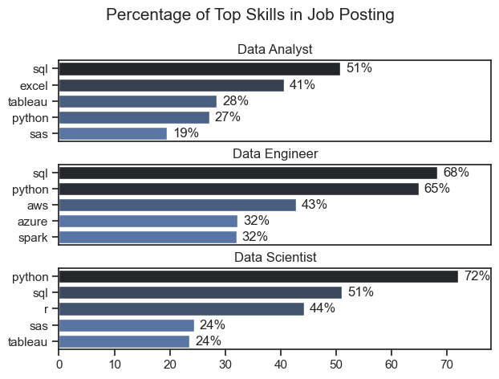
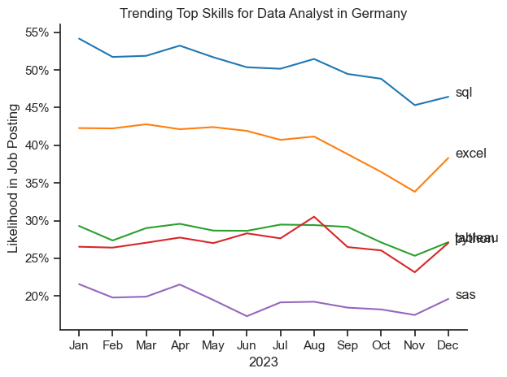
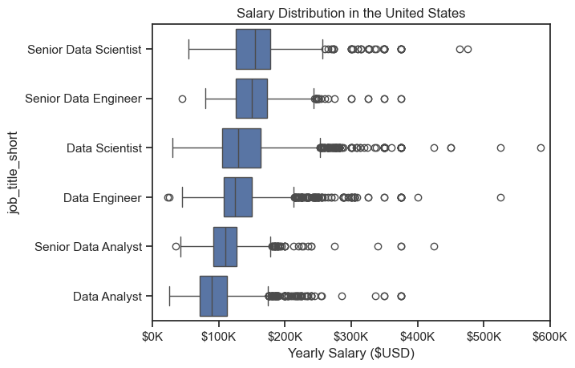

# The Analysis

## 1. What are the most demanded skills for the top 3 most popular data roles?

This analysis examines the most demanded skills for the three most popular data roles—Data Analyst, Data Scientist, and Data Engineer—by analyzing job postings and skill frequency across each role. The results show that core skills such as SQL and Python are consistently in high demand across all three positions, highlighting their importance as foundational tools in the data field. Data Analysts tend to require strong proficiency in SQL, Excel, and data visualization tools like Tableau or Power BI, reflecting their focus on querying and presenting data. Data Scientists show higher demand for Python, machine learning libraries, and statistical skills, emphasizing advanced analysis and modeling. Data Engineers, on the other hand, are most frequently associated with Python, SQL, cloud platforms, and big data technologies, underscoring their role in building and maintaining data pipelines. Overall, while each role has specialized skill requirements, the overlap in core technical skills suggests a shared foundation across data careers.

view my notebook with detailed steps here: [2_Skills_Count.ipynb](project/2_Skills_Count.ipynb)

### Visualize Data

```python 
fig, ax = plt.subplots(len(job_titles), 1)
sns.set_theme(style='ticks')

for i, job_title in enumerate(job_titles):
    df_plot = df_skills_perc[df_skills_perc['job_title_short'] == job_title].head(5)
   # df_plot.plot(kind='barh', x='job_skills', y='percent_count', ax=ax[i], title=job_title)
    sns.barplot(data=df_plot, x='percent_count', y='job_skills', ax=ax[i], hue='skill_count', palette='dark:b_r')
    ax[i].set_title(job_title)
    ax[i].set_xlabel('')
    ax[i].set_ylabel('')
    ax[i].legend().remove()
    ax[i].set_xlim(0, 78)

    for n, v in enumerate(df_plot['percent_count']):
        ax[i].text(v + 1, n, f'{v:.0f}%', va='center')

    if i != len(job_titles) - 1:
        ax[i].set_xticks([])    

fig.suptitle('Percentage of Top Skills in Job Posting', fontsize=15)
fig.tight_layout(h_pad=0.5) # 
plt.show()
```

### Results



### Insights

- SQL is the most consistently demanded skill across all roles, especially for Data Engineers (68%) and Data Analysts (51%).
- Python dominates Data Scientist roles (72%) and is also critical for Data Engineers (65%), showing its versatility across advanced data tasks.
- Data Analysts rely more on business tools like Excel (41%) and Tableau (28%), reflecting a focus on reporting and visualization.
- Cloud and big data skills (AWS, Azure, Spark) are unique to Data Engineer roles, highlighting their infrastructure-focused responsibilities.
- Data Scientists require a broader analytical toolkit, combining Python, SQL, and R, emphasizing statistical and modeling expertise.

## 2. How are in-demands skills trending for data analysts? 

### Visualize data

```python

from matplotlib.ticker import PercentFormatter
ax = plt.gca()
ax.yaxis.set_major_formatter(PercentFormatter(decimals=0))

for i in range(5):
    plt.text(11.2, df_plot.iloc[-1, i], df_plot.columns[i])

```

### Results


*Bar graph visualizing the trending top skills for data analyst in the US in 2023*

### Insights:

- SQL is the most in-demand skill all year, with only a slight late-year dip, making it essential for data analyst roles.
- Excel remains the second most required skill, showing stable demand but noticeable seasonal drops toward the end of the year.
- These skills have moderate to lower demand and mainly act as value-add differentiators rather than core requirements.

## 3. How well do job and skills pay for Data Analysts?

### Salary Analysts for Data Nerd

### Visualize Data

```python
sns.boxplot(data=df_Us_top6, x='salary_year_avg', y='job_title_short', order=job_order)
sns.set_theme(style='ticks')

plt.title('Salary Distribution in the United States')
plt.xlabel('Yearly Salary ($USD)')
ax = plt.gca()
ax.xaxis.set_major_formatter(plt.FuncFormatter(lambda x, _: f'${int(x/1000)}K'))
plt.xlim(0, 600000)
plt.show()
```

### Results


*Box plot visualizing the salary distribution for the top 6 data job titles*

### Insights:

- Clear pay hierarchy by role and seniority:- Senior roles (Senior Data Scientist / Senior Data Engineer) consistently earn more than their non-senior counterparts, with higher medians and upper quartiles. Among all roles, Senior Data Scientists appear to have the highest typical pay.
- Wide salary spread, especially in technical roles:- Data Scientist and Data Engineer roles show large variability—the boxes and whiskers are wide, and there are many high-end outliers. This suggests pay is heavily influenced by factors like company, location, industry, and experience level.
- Strong presence of extreme high-end outliers:-  Several roles (especially Data Scientist and Data Engineer) have outliers well above $300K–$500K+, indicating that while uncommon, very high compensation packages exist—likely tied to top tech firms, leadership responsibilities, or total comp including bonuses and equity.

### Highest paid and Most IN-Demand Skills for Data Analysts

### Visualize Data

```python
#Top 10 Highest Paid Skills for Data Analyst
sns.barplot(data=df_DA_skills, x='median', y=df_DA_skills.index, hue='median', ax=ax[0], palette='dark:b')
ax[0].legend().remove()
#without seborn library
# df_DA_skills[::-1].plot(kind=barh, y='median', ax=ax[0], legend=False)
ax[0].set_title('Top 10 Highest Paid Skills for Data Analyst')
ax[0].set_xlabel('')
ax[0].set_ylabel('')
ax[0].xaxis.set_major_formatter(plt.FuncFormatter(lambda x, _: f'${int(x/1000)}K'))

#Top 10 Most In-Demand Skills for Data Analyst
sns.barplot(data=df_DA_skills, x='median', y=df_DA_skills.index, hue='median', ax=ax[1], palette='dark:b')
ax[1].legend().remove()
#without seborn library
# df_DA_skills[::-1].plot(kind=barh, y='median', ax=ax[1], legend=False)
ax[1].set_title('Top 10 Most In-Demand Skills for Data Analyst')
ax[1].set_xlabel('')
ax[1].set_ylabel('')
ax[1].xaxis.set_major_formatter(plt.FuncFormatter(lambda x, _: f'${int(x/1000)}K'))
```

### Results


*Two separate bar graphs visualizing the highest paid and most in-demand skills for data analyst in the US*

### Insights:

- Python clearly leads in both salary and demand: It ranks #1 in highest pay and most in-demand skills, making it the strongest core skill for data analysts.

- Data visualization tools (Tableau & Power BI) are highly valued: Tableau ranks near the top in both pay and demand, while Power BI also performs strongly—showing that visualization skills are critical alongside technical analysis.

- SQL remains a foundational requirement: SQL and SQL Server consistently rank high in both charts, indicating that database querying is a must-have skill for data analysts across industries.

- Conclusion: To maximize both employability and salary as a data analyst, focus on Python + SQL + a visualization tool (Tableau or Power BI). These combined skills provide the strongest competitive advantage in today’s market.